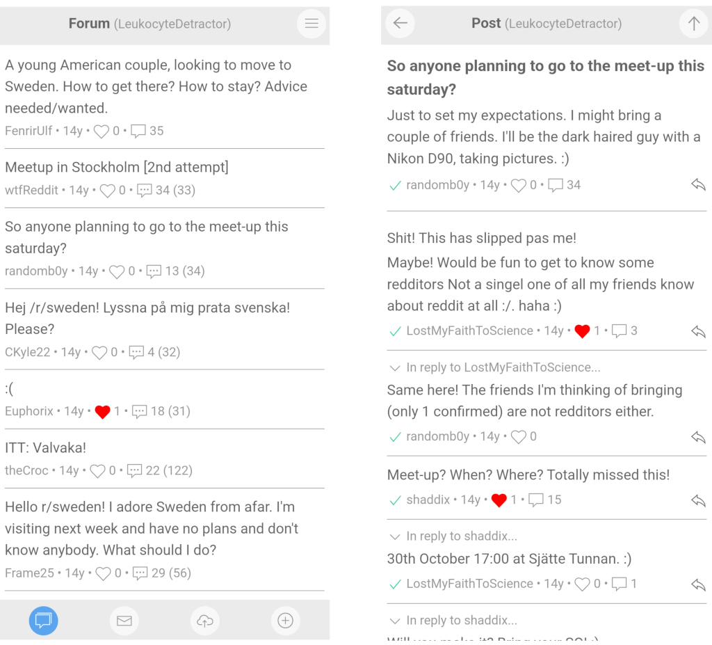

# Bespoke BBS (B3S) - A location-based BBS



## What?

Bespoke BBS (B3S) is a location-based Bulletin Board System and it
includes a *Forum*, end-to-end encrypted *Direct Messaging* and *File
Sharing*.

B3S not meant for the Internet—instead, it lives in your local area as
a WiFi Access Point.

The B3S client Web app will be wrapped into native Android app to make
it effortless to sync content in the background just by passing near a
B3S server instance. You'll also be able to interact with B3S offline,
with syncing handled automatically when reconnected.

## Why?

Internet has just become a cesspool of mass surveillance, manipulative
algorithms, influencers, relentless tracking, and endless spam. Let's
strip away the noise and keep things local, simple, and meaningful
instead.

## How?

B3S is a self-contained BBS web app running behind its own WiFi Access
Point—no Internet required. The necessary hardware is cheap and
installation is effortless.

You might wonder if the WiFi range is too short to make this
practical. In most cases, with a clear line of sight, you can achieve
a range of several hundred meters. Add a low-cost sector antenna, and
that range extends up to four times.

### Installation

* $15: Buy a Raspberry Pi Zero 2W: https://www.adafruit.com/product/5291
* $10: Buy a SD/MicroSD Memory Card (8 GB SDHC):
  https://www.adafruit.com/product/1294

Download the latest Bespoke image from
https://github.com/joagre/bespoke/releases and write it to the SD
card. On a Linux machine:

```
gunzip bespoke-0.1.0.img.gz
sudo dd if=bespoke-0.1.0.img of=/dev/mmcblk0 bs=4M status=progress
sync
```

Insert the SD card into the Pi and power it up, then connect to the
BespokeBBS SSID and follow the instructions.

That's it.

Optionally buy an extra WiFi USB adapter and a Directional Panel
Antenna to extend the range:

* $28: WiFi USB adapter:
  https://alfa-network.eu/wi-fi/wi-fi-adapters/awus036nhv
* $18: Directional Panel Antenna:
  https://alfa-network.eu/antennas/wi-fi-antennas/apa-m25

Optionally 3D-print a Raspberry Pi Zero Case:
https://www.thingiverse.com/thing:1167846
